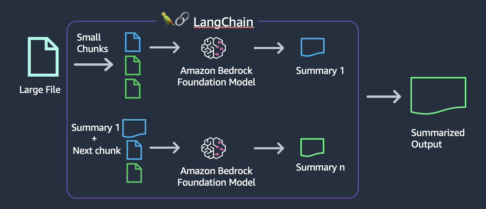

# Lab 2 - Text Summarization

## Overview

텍스트 요약은 텍스트 문서에서 가장 관련성이 높은 정보를 추출하여 간결하고 일관된 형식으로 제시하는 자연어 처리(NLP) 기법입니다.

요약은 다음 예와 같이 모델에 프롬프트 명령을 전송하여 모델에 텍스트를 요약하도록 요청하는 방식으로 작동합니다:


```xml
다음 텍스트를 요약하세요:

<text>
Lorem ipsum dolor sit amet, consectetur adipiscing elit, 
sed do eiusmod tempor incididunt ut labore et dolore magna aliqua. 
Sem fringilla ut morbi tincidunt augue interdum velit euismod in. 
Quis hendrerit dolor magna eget est.
<text>
```

모델이 요약 작업을 실행하도록 하기 위해 프롬프트 엔지니어링이라는 기술을 사용하여 모델이 데이터를 처리할 때 예상되는 사항과 응답에 대한 지침을 일반 텍스트로 모델에 보냅니다. 이에 대해 자세히 알아보려면 [이 문서](https://www.promptingguide.ai/)를 참조하세요.

## Why is it relevant

일반적으로 사람들은 해야 할 일이 많아 바쁩니다. 참석해야 할 회의, 읽어야 할 기사 및 블로그 등이 있습니다. 요약은 중요한 주제를 최신 상태로 유지하는 데 도움이 되는 좋은 기술입니다.  

이 모듈에서는 Amazon Bedrock API를 사용하여 크고 작은 텍스트를 빠르게 요약하여 밑바탕에 있는 이해를 단순화할 수 있습니다.

이 데모의 아이디어는 가능한 기술과 이 예제를 복제하여 다른 일반적인 시나리오를 다음과 같이 요약하는 방법을 보여주기 위한 것입니다:

- 학술 논문
- 트랜스크립션:
    - 비즈니스 통화 후
    - 콜 센터
- 법률 문서
- 재무 보고서

## Target Audience

이 모듈은 파이썬에 익숙한 개발자라면 누구나 실행할 수 있으며, 데이터 과학자 및 기타 기술 담당자도 실행할 수 있습니다.

## Patterns

이 워크숍에서는 요약에 대한 다음과 같은 패턴을 배울 수 있습니다:

1. [짧은 텍스트 요약](./01.small-text-summarization-claude.ipynb)

    

2. [추상적인 텍스트 요약](./02.long-text-summarization-titan.ipynb)

    