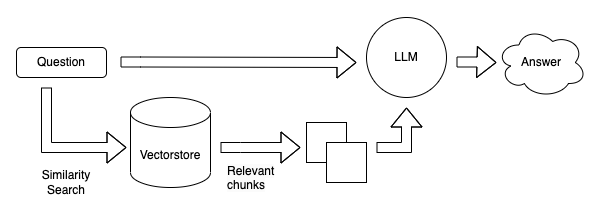

# Lab 4 - 대화 인터페이스 (Chatbots)

## 개요

챗봇 및 가상 비서와 같은 대화 인터페이스를 사용하여 고객의 사용자 경험을 향상할 수 있습니다. 챗봇은 자연어 처리(NLP) 및 기계 학습 알고리즘을 사용하여 사용자의 질문을 이해하고 응답합니다. 챗봇은 고객 서비스, 영업, 전자상거래 등 다양한 애플리케이션에서 사용자에게 빠르고 효율적인 응답을 제공하기 위해 사용될 수 있습니다. 웹사이트, 소셜 미디어 플랫폼, 메시징 앱 등 다양한 채널을 통해 액세스할 수 있습니다.

## Amazon Bedrock을 사용하는 챗봇

## 사용 사례

1. **챗봇(기본)** - FM 모델을 사용한 Zero Shot 챗봇
2. **프롬프트를 사용하는 챗봇** - 템플릿(Langchain) - 프롬프트 템플릿에 일부 컨텍스트가 제공되는 챗봇
3. **페르소나가 있는 챗봇** - 정의된 역할이 있는 챗봇입니다. 예, 커리어 코치와 인간 상호 작용
4. **컨텍스트 인식(contextual-aware) 챗봇** - 임베딩을 생성하여 외부 파일을 통해 컨텍스트를 전달합니다.

## Amazon Bedrock을 사용하여 Chatbot을 구축하기 위한 Langchain 프레임워크
챗봇과 같은 대화형 인터페이스에서는 단기적으로나 장기적으로 이전 상호 작용을 기억하는 것이 매우 중요합니다.

LangChain은 두 가지 형태로 메모리 구성 요소를 제공합니다. 첫째, LangChain은 이전 채팅 메시지를 관리하고 조작하기 위한 도우미(helper) 유틸리티를 제공합니다. 이는 모듈식으로 설계되었으며 사용 방법에 관계없이 유용합니다. 둘째, LangChain은 이러한 유틸리티를 체인에 통합하는 쉬운 방법을 제공합니다.
이를 통해 다양한 유형의 추상화를 쉽게 정의하고 상호 작용할 수 있으므로 강력한 챗봇을 쉽게 구축할 수 있습니다.

## 맥락(컨텍스트)를 고려한 챗봇 구축 - 핵심 요소

컨텍스트 인식(contextual-aware) 챗봇을 구축하는 첫 번째 프로세스는 컨텍스트에 대한 **임베딩을 생성**하는 것입니다. 일반적으로 임베딩 모델을 통해 실행되고 일종의 벡터 저장소에 저장될 임베딩을 생성하는 수집 프로세스가 있습니다. 이 예에서는 이를 위해 GPT-J 임베딩 모델을 사용하고 있습니다.

두 번째 프로세스는 사용자 요청 오케스트레이션, 상호 작용, 호출 및 결과 반환입니다.

## Architecture [Context Aware Chatbot]

이 아키텍처에서:

1. LLM에게 묻는 질문은 임베딩 모델을 통해 실행됩니다.
2. 컨텍스트 문서는 [Amazon Titan Embeddings Model](https://aws.amazon.com/bedrock/titan/)을 사용하여 임베딩되고 벡터 데이터베이스에 저장됩니다.
3. 임베딩된 텍스트는 컨텍스트 검색을 위해 채팅 기록과 함께 FM에 입력으로 제공됩니다.
4. FM 모델은 맥락(컨텍스트)에 맞는 결과를 제공합니다.

## Notebooks
이 모듈에서는 동일한 패턴에 대한 2개의 노트북을 제공합니다. Anthropic Claude 및 Amazon Titan Text Large와의 대화를 통해 각 모델의 성능을 각각 경험할 수 있습니다.

1. [Chatbot using Claude](./00_Chatbot_Claude.ipynb)
2. [Chatbot using Titan](./00_Chatbot_Titan.ipynb)
